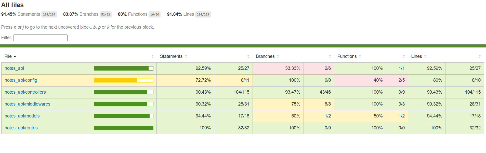
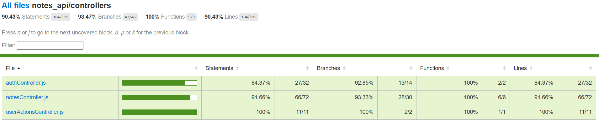

# Notes API

## Description

This is an API for notes. It allows you to create, read, update, delete, share and search for notes.

## Tech Stack

- [Express.js](https://expressjs.com/) for server side API framework
- [Mongoose](https://mongoosejs.com/) MongoDB ORM
- [JWT](https://jwt.io/) for authentication
- [Swagger](https://swagger.io/) for API documentation
- [express-rate-limit](https://www.npmjs.com/package/express-rate-limit) for API rate limiting
- [bcrypt](https://www.npmjs.com/package/bcrypt) for password hashing

## Directory Structure

- `/`
  - `README.md`
  - `package.json` (contains project dependencies)
  - `/tests` (test files for API endpoints)
  - `/models` (mongoose schemas for notes)
  - `/controllers` (business logic for the API)
  - `/routes` (API routes definition)
  - `/middlewares` (middlewares for API routes)
  - `/config` (configuration files)

## Steps to setup and run the API locally

- Prepare a MongoDB database at `mongodb://127.0.0.1:27017/UserNotes`. Instructions for setting up MongoDB can be found [here](https://www.mongodb.com/docs/manual/administration/install-community/)

- Create `.env` file at the root of the repository

  Example of `.env` file:

  ```
  DB_URI = mongodb://127.0.0.1:27017/UserNotes
  TEST_DB_URI = mongodb://127.0.0.1:27017/UserTestNotes
  CONNECTION_POOL_SIZE = 10
  JWT_SECRET = secret@1234
  NODE_ENV = dev
  ```

- Install nodemon to run the API server locally with `npm install -g nodemon`
- Run `npm install` to install dependencies
- Run `npm run dev` to start the API server
- Test the API with `npm test`

- After server is running, go to `http://localhost:<5000 | PORT given in .env>` and test the API
- To test the API with Swagger UI, go to `http://localhost:<5000 | PORT given in .env>/api-docs/index.html`
- To check test coverage open `<directory_path_to_repo_root>/notes_api/coverage/index.html`. For coverage files to be generated you first need to run thes test with `npm test`

## Test Coverage

- [nyc](https://www.npmjs.com/package/nyc) for code coverage
- [mocha](https://www.npmjs.com/package/mocha) for test runner

### Overall Code Coverage



### Business Logic Test Coverage


